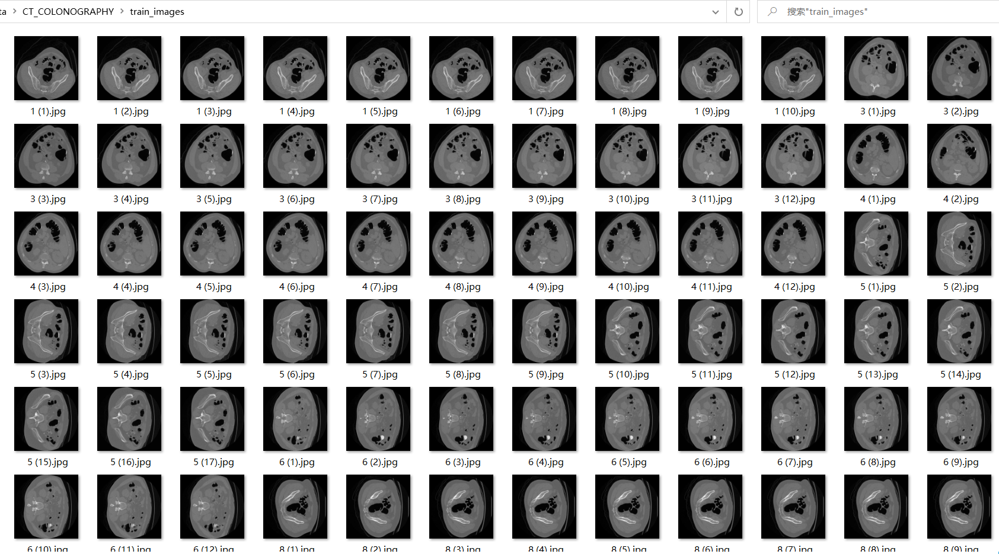

# CT_COLONOGRAPHY
2020年(第13届)中国大学生计算机设计大赛  人工智能挑战赛赛题二 数据集

## Note
数据均来自[赛方](http://2020.jsjds.cn/AI/)，这里提供一种划分方式，**仅供基准测试,绝不代表赛方测试结果!!!**。

#### 文件命名方式：

1. 第二批数据名称均保持不变。
2. 第一批带标签的图片全部重命名为 `编号 (序号).jpg`，其中相同编号的多张图片就是我认为较相似的图片。
3. 第一批的标签文件与对应图片同使用相同文件名。
4. 为防止第一批与第二批无标签图片同文件名，已经将第一批里无标签图片重命名为 `no_target (序号).jpg`

第二批公开数据集中带标签的图片已经给出了患者编号，但第一批公开数据集没有，所以我将第一批数据中比较相似的图片用同一个编号，**如何判断相似 全凭我主观观察，难免有误差**。

#### 当前划分方式

1. 带标签的图片以相同编号为单位划分为训练、测试集，相同编号的图片不会同时出现在训练集和测试集。
2. 不带标签的图片没有区分患者编号，随便选取了一部分放到了测试集，**这可能会产生问题**。

#### 数量

|     | 含息肉 | 不含息肉 |
|  ----  | ----  | ----  |
| `训练集`  | 1960 | 1360 |
| `测试集`  | 453 | 327 |

#### 文件说明

|  文件夹 | 说明 |
|  ----  | ----  |
| `all_images`  | 全部带有标签的图片 |
| `all_images_nolabel`  | 全部不带标签的图片 |
| `all_labels`  | 全部的标签，与 `all_images` 对应 |
| `train_images`  | 训练集中带标签的图片 |
| `train_images_nolabel`  | 训练集中不带标签的图片 |
| `train_labels`  | 训练集的标签，与 `train_images` 对应 |
| `test_images`  | 测试集中带标签的图片 |
| `test_images_nolabel`  | 测试集中不带标签的图片 |
| `test_labels`  | 测试集的标签，与 `test_images` 对应 |

